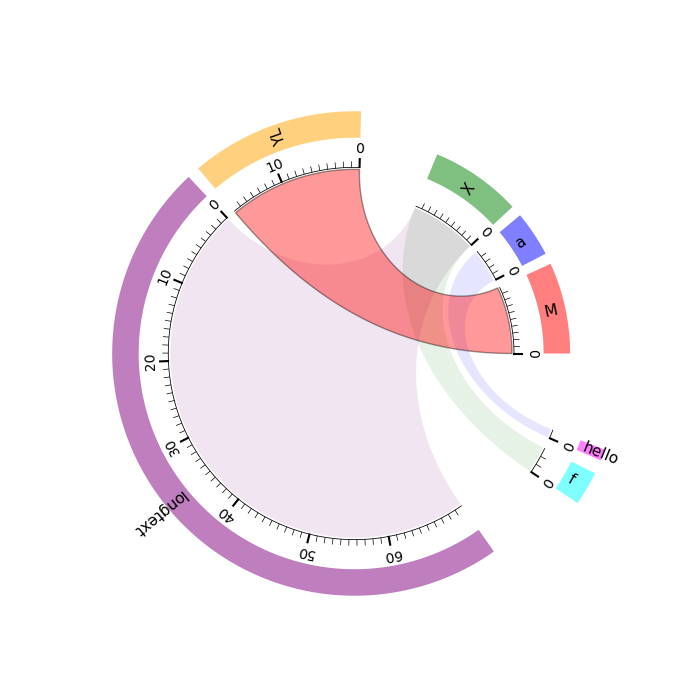

chordbb - Building Blocks for Chord Plots
=========================================

**DISCLAIMER**: This project is work in progress and does not yet provide
everything needed to produce publication-ready chord plots. Thus, use at own
risk.

Introduction
------------

``chordbb`` provides building blocks to generate custom chord plots.
While there exist other solutions to draw chord diagrams using python and in
particular matplotlib (see further below), ``chordbb`` has a special focus on
customization. That is, ``chordbb`` does not assume a one-size-fits-all style
for chord diagrams but rather assumes that a user wants to heavily customize the
end result.

Installation
------------

At the moment, ``chordbb`` is not yet available on PyPI. To install it, you
therefore need to download or clone this repository and then use ``pip`` or
another python package manager.
Example:

.. code-block:: sh

    $ git clone https://github.com/nwaniek/matplotlib-chordbb.git
    $ cd matplotlib-chordbb
    $ pip install .

In the future, meaning as soon as ``chordbb`` is available on PyPI, you can
install it by simply running

.. code-block:: sh

    $ pip install matplotlib-chordbb

Usage
-----

A basic example on how to use ``chordbb`` is provided in the file
`example.py <example.py>`_, which was used to generate the figure above.

Extending ``chordbb``
---------------------

``chordbb`` is kept as simple as possible while also being flexible.
Specifically, ``chordbb`` internally fills a dictionary for each segment that
might be plottet. This dictionary contains information, such as where the
segment starts and ends, as well as other values. If you want to develop a
custom renderer for a segment, you only need to implement a function that takes
an axis and a segment, and then renders what you want to display. For an example
of this, have a look at one of the existing renderes, e.g.
``ChordArcAxisTicker``.

If you wish to extend ``chordbb`` with other types than the standard types that it
already supports, autoinc, np.ndarray, and other BLOBs, then best have a look at
``tinysql``'s ``TYPE_MAPPING`` variable. This is simply a dict which contains a map
from a type that you want to use in a type annotation to the sqlite database
type and some additional flag. You can either inject your own type mappings into
``TYPE_MAPPING``, or change it directly there (remember, tinysql is as basic as it
gets, and a 'single file package').

Contributing
------------
Contributions are welcome!
If you have suggestions, bug reports, or want to contribute code, please open an issue or submit a pull request on GitHub, or send an e-mail.

Alternatives
------------
Of course, there exist alternatives to ``chordbb``.
For instance, the excellent `mpl-chord-diagram <https://codeberg.org/tfardet/mpl_chord_diagram>`, which is feature rich and stable.
The benefit of ``chordbb`` over other solutions is an improved level of customization.

License
-------
``chordbb`` is licensed under the MIT License.
See the `LICENSE <LICENSE>`_ file for details.

